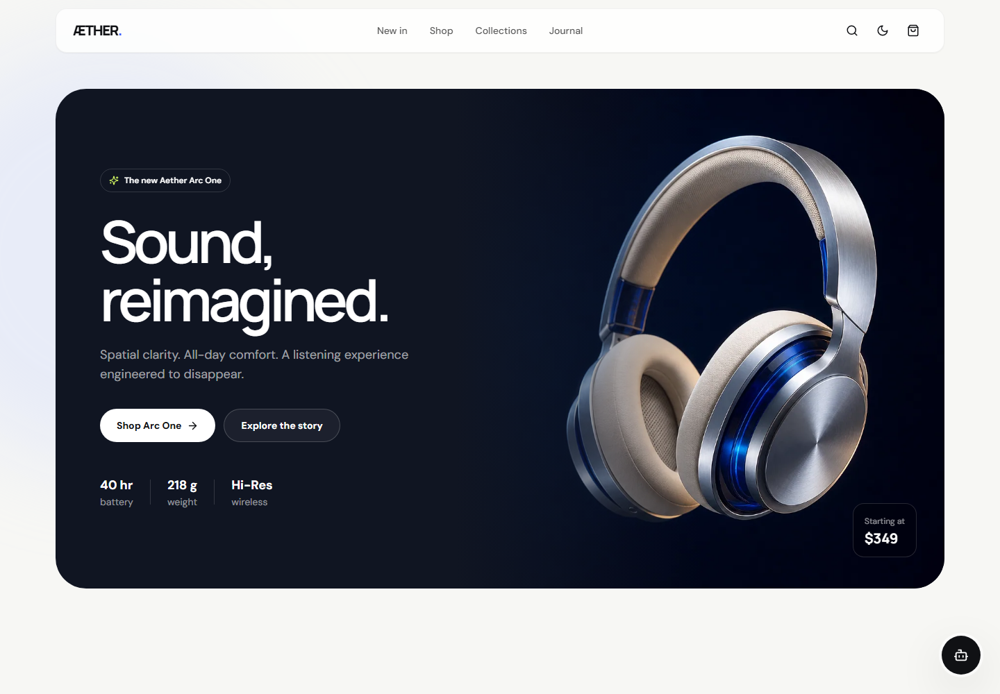

# Aether Commerce

A premium, responsive e-commerce homepage created for a front-end internship evaluation. The experience focuses on visual hierarchy, interaction design, responsiveness, accessibility, and maintainable React architecture.



## Live demo

Add the deployed URL here after publishing with Vercel, Netlify, or GitHub Pages.

## Technology stack

- React 19
- Vite 6
- Tailwind CSS 3
- Framer Motion
- Lucide React
- Browser `localStorage`

## Highlights

- Responsive, mobile-first storefront layout
- Sticky glass-effect navigation
- Animated editorial hero section
- Trending categories and premium product catalog
- Flash-sale countdown
- Dark and light themes with saved preference
- Recently viewed products saved locally
- Interactive cart feedback, wishlist controls, and newsletter state
- Floating AI shopping-assistant concept
- Reduced-motion support and accessible labels
- Optimized WebP product imagery

## Run locally

```bash
npm install
npm run dev
```

Open the local URL shown by Vite.

## Quality checks

```bash
npm run lint
npm run build
```

Preview the production build:

```bash
npm run preview
```

## Project structure

```text
src/
├── components/
│   ├── Assistant.jsx
│   ├── Navbar.jsx
│   └── ProductCard.jsx
├── App.jsx
├── data.js
├── index.css
└── main.jsx
```

## Deployment

The project is deployment-ready with no environment variables or database setup.

### Vercel

Import the repository and use the detected Vite defaults:

- Build command: `npm run build`
- Output directory: `dist`

### Netlify

- Build command: `npm run build`
- Publish directory: `dist`

## Notes

Product data is intentionally sample content because the assignment does not require backend or database integration. Theme and recently viewed state are persisted in the browser.
